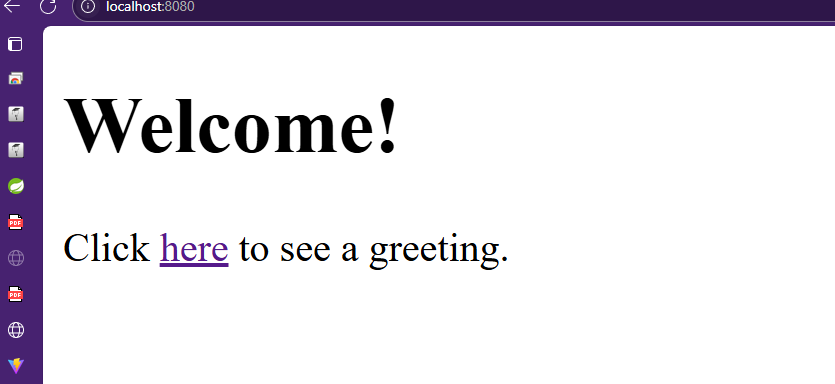
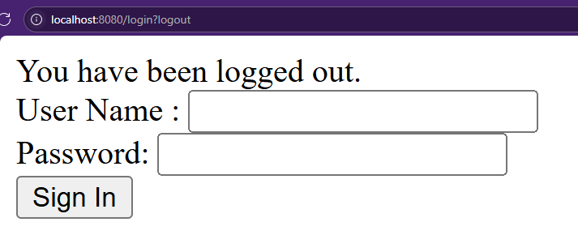
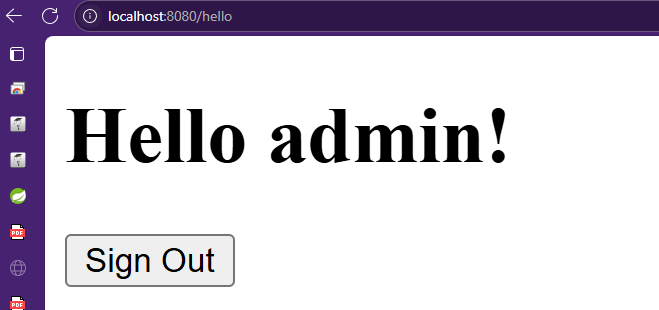
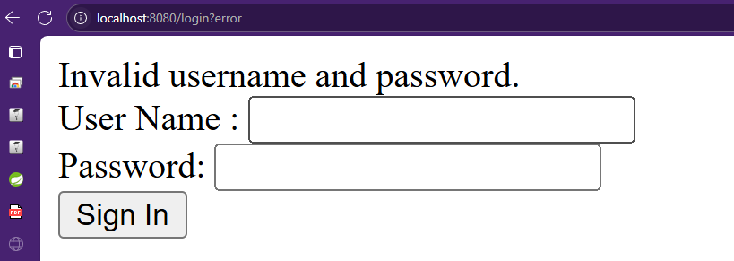

# Securing Web (Spring Boot + MongoDB)

<p align="center">
  
  
  
</p>

## Tecnologías utilizadas
- **Spring Boot** 
- **MongoDB** 
- **Thymeleaf** 
- **Java 17+**
- **Maven**

---

Este proyecto es una aplicación web segura construida con Spring Boot y MongoDB. Permite autenticación de usuarios almacenados en la base de datos y redirección tras login.

## Instalación y ejecución

1. **Clona el repositorio y entra a la carpeta del proyecto:**
   ```
   cd securing-web
   ```

2. **Pantalla de bienvenida**

   

3. **Antes de logearse (pantalla de login)**

   

4. **Logeado correctamente (pantalla hello)**

   

5. **Usuario o contraseña incorrectos**

   

6. **Configura la conexión a MongoDB**
   Edita `src/main/resources/application.properties` con tu URI y base de datos:
   ```properties
   spring.data.mongodb.uri=mongodb+srv://<usuario>:<contraseña>@<host>/<db>
   spring.data.mongodb.database=<db>
   ```

7. **Agrega usuarios manualmente a la colección `usuarios` en MongoDB:**
   - El campo `password` debe tener el prefijo `{bcrypt}` si está hasheado, o `{noop}` si es texto plano (solo para pruebas).
   - Ejemplo:
     ```json
     {
       "username": "user1",
       "password": "{noop}password1",
       "role": "USER"
     }
     ```

8. **Ejecuta la aplicación:**
   - En Windows:
     ```
     mvnw spring-boot:run
     ```
   - O si tienes Maven instalado globalmente:
     ```
     mvn spring-boot:run
     ```

9. **Accede a la app:**
   - [http://localhost:8080/](http://localhost:8080/)
   - Login en `/login` (redirige a `/hello` tras autenticación)

## Estructura principal
- `src/main/java/com/example/securing_web/model/Model.java`: Modelo de usuario
- `src/main/java/com/example/securing_web/repository/MyRepository.java`: Repositorio MongoDB
- `src/main/java/com/example/securing_web/securingweb/WebSecurityConfig.java`: Configuración de seguridad
- `src/main/resources/templates/`: Vistas Thymeleaf (`login.html`, `hello.html`, etc.)

## Notas
- No hay registro de usuarios desde la web, solo autenticación.
- Si ves errores 404 en rutas extrañas, son peticiones automáticas del navegador y puedes ignorarlas.

---

¿Dudas? Modifica este README según tus necesidades.
